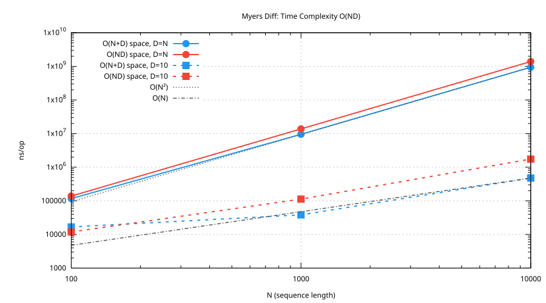
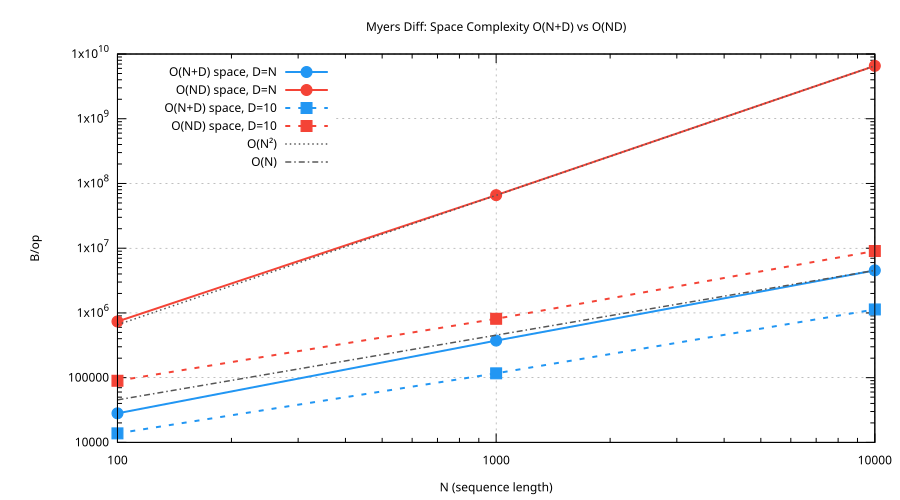

# diff

A Myers diff algorithm implementation in Go. Includes `gdiff`, a minimal command-line diff tool.

## Install

```sh
go install github.com/teleivo/diff/cmd/gdiff@latest
```

## Library

```go
import "github.com/teleivo/diff"

edits := diff.Lines(oldLines, newLines)

// Write in unified diff format
diff.Write(os.Stdout, edits)

// Write with gutter format (line numbers, visible whitespace)
diff.Write(os.Stdout, edits, diff.WithGutter())

// Write with ANSI color (red deletions, green insertions)
diff.Write(os.Stdout, edits, diff.WithGutter(), diff.WithColor())
```

Given a DOT file before and after formatting with [dotx](https://github.com/teleivo/dot):

```dot
// old.dot                           // new.dot
digraph {                            digraph {
    3 -> 2 -> 4                          3 -> 2 -> 4
      [color="blue",len=2.6]              [color="blue",len=2.6]
        rank = same                      rank=same
                                     }
}
```

Unified (`gdiff old.dot new.dot`):

```
@@ -1,5 +2,4 @@
 digraph {
 	3 -> 2 -> 4 [color="blue",len=2.6]
-		rank = same
-
+	rank=same
 }
```

Gutter (`gdiff --gutter old.dot new.dot`):

```
1   │ digraph {
2   │ 	3 -> 2 -> 4 [color="blue",len=2.6]
3 - │ →→rank·=·same
4 - │ ↵
  + │ →rank=same
5   │ }
```

## CLI

```sh
gdiff file1.txt file2.txt
gdiff --gutter file1.txt file2.txt
```

Exit codes: 0 (identical), 1 (differences found), 2 (error)

## Animation

`animate-myers` visualizes the quadratic space Myers diff algorithm on an edit graph using the
example from Myers' 1986 paper.

It shows how the algorithm explores the edit graph by incrementing the edit distance d. For each d,
the furthest reaching point on each diagonal is shown. The final frame shows the shortest edit
script found by backtracking.

Requires [Graphviz](https://graphviz.org/) and a terminal with
[Kitty graphics protocol](https://sw.kovidgoyal.net/kitty/graphics-protocol/) support.

```sh
go run ./cmd/animate-myers
go run ./cmd/animate-myers --speed 2      # faster animation
go run ./cmd/animate-myers --step         # press any key to advance each frame
go run ./cmd/animate-myers --dpi 200      # higher resolution
```

## Development

### Benchmarks

```sh
go test -bench=. | tee results.bench
./plot.sh results.bench
```

The plots show how time and space scale with sequence length N across two D (edit distance) values,
and confirm both implementations match their theoretical complexity.




### Profiling

Generate test files and run profiling:

```sh
seq 1 100000 > a.txt
seq 1 100000 | awk 'NR%2==0{print $0"x"} NR%2!=0{print}' > b.txt

go build -o gdiff ./cmd/gdiff
./gdiff --cpuprofile cpu.prof --memprofile mem.prof a.txt b.txt > /dev/null

go tool pprof -top cpu.prof
go tool pprof -alloc_space -top mem.prof
```

## Acknowledgments

This implementation is based on James Coglan's great blog series ["The Myers Diff Algorithm"](https://blog.jcoglan.com/2017/02/12/the-myers-diff-algorithm-part-1/)
which walks through Eugene Myers' 1986 paper ["An O(ND) Difference Algorithm and Its Variations"](http://www.xmailserver.org/diff2.pdf).

## Disclaimer

I wrote this library for my personal projects and it is provided as-is without warranty. It is
tailored to my needs and my intention is not to adjust it to someone else's liking. Feel free to use
it!

See [LICENSE](LICENSE) for full license terms.
